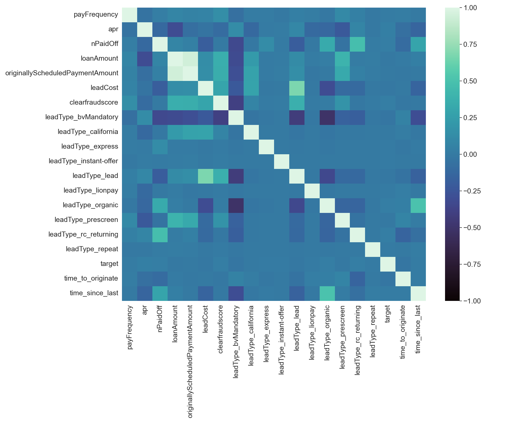

# Introduction

The goal of this project is to develop a model for [MoneyLion](https://www.moneylion.com/) that can predict whether a given loan application will default, based on the outcomes of previously funded loans. 

The process for a prospective borrower (hereafter: _client_) is as follows:
1. Client submits loan application.
2. MoneyLion sends client details to underwriters for fraud detection (can be automated, manual, or both).
3. If there are no clear & obvious signs of fraud, application is approved.
4. Once a loan deposit is made, application gets funded.

Ideally, we'd like our model to operate between steps 2 & 3, assessing the risk of each application & acting as a final guardrail before a loan ultimately gets approved. Naturally, we can assume that step 2 filters out a large majority of fraudulent applications, allowing us to focus our attention solely on risk assessment. 

We hope that this will provide MoneyLion a straightforward way of evaluating the risk of each application against their own risk tolerance, opening up the channel for more well-informed business decisions. 

# Feature Engineering

After sufficiently cleaning the dataset, we're left with the following features:

- `loan_id` & `anon_ssn` can be used to identify and track the client.
- `applicationDate` & `originatedDate` provide information on the timing of the loan.
- `loanAmount` & `apr` provide information on the cost of borrowing, which can be used to assess the affordability of the loan.
- `payFrequency` & `originallyScheduledPaymentAmount` provide information on the terms of the loan, which can be used to assess the client's ability to make regular payments.
- `loanStatus` is used to identify the status of the loan (default, not default, ongoing, etc).
- `nPaidOff` provides information on the client's loan repayment history, which is relevant to determining the client's trustworthiness. 
- `leadType` & `leadCost` can provide information on the source & cost of obtaining the loan, which may be relevant to assessing the quality of the loan.
- `clearfraudscore` can be used to identify and flag any potential fraud. 

From there, we create 3 additional features:

### Target Variable

First, a binary target variable to represent whether a given loan application has defaulted or not. We do so by transforming the `loanStatus` column, such that a value of `target == 1` indicates a favorable outcome (i.e. did not default), whereas a value of `target == 0` indicates an unfavorable outcome (i.e. default).

### Temporal Features

Additionally, we transform the `applicationDate` & `originatedDate` columns into `time_to_originate` & `time_since_last`; the former is calculated from the difference between `application_date` & `originated_date`, in hours, providing information on the time it took for the loan to be originated, which may be relevant to assessing the quality of the application; the latter represents the time between consecutive loan applications by a given client, in days, where -1 is used inplace of non-returning clients.

# Exploratory Data Analysis (EDA)

We then generate effective visualizations to better understand the data. Our findings are summarized as follows:

1. General business insights: (a) MoneyLion funded roughly 1.75x more loans from 2016 vs 2015; (b) the number of loan applications are concentrated near December & January, most likely as a result of the holiday season. Naturally, MoneyLion funds the most loans during Q1 & Q4; (c) MoneyLion funds less loans whose applications were received on weekends compared to weekdays (most likely explanation: less people submit loan applications on weekends).

  
   
  <em></em>

Moreover, (d) most loan applications are originated within a few hours, and (e) most returning clients submit another successful application roughly 200 days after their last.

  
   
  <em></em>

2. There is a significant class imbalance against defaulted loans, which we must address during preprocessing.

  
   
  <em>97.38% of our data represents non-defaulted loans, whereas only 2.62% of the data are defaulted.</em>

3. The numeric features are heavily skewed, implying that we should either pick a model that's robust to skewness, and/or normalize these data during preprocessing.

  
   
  <em>Distribution of unnormalized features.</em>

4. There are no significant correlations between the features and the target variable. Furthermore, the only (relevant) highly correlated features are `loanAmount` & `originallyScheduledPaymentAmount` (0.94), which is useful to keep in mind in the event that our model ends up generating unreliable/unstable predictions (may be due to multicolinearity).

  
   
  <em></em>

